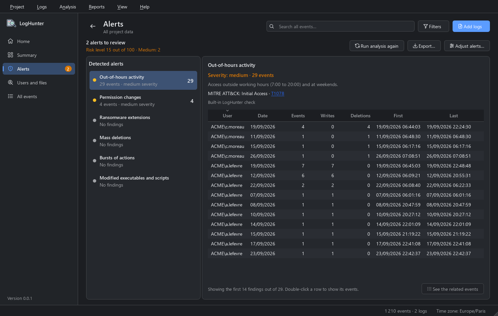

# LogHunter

**Who did what, and when?** A free, fully offline Windows event log (`.evtx`) analyzer for Windows and Linux.


Event Viewer gives you a raw list. LogHunter links events together, flags suspicious behaviour and rebuilds the history of every file. In a few seconds you get a usable overview, whether you are investigating an incident or auditing access to a file share.

- **Threat detection** with Sigma rules, mapped to MITRE ATT&CK
- **File access tracking**: who read, modified or deleted what
- **Interactive timeline** and clickable dashboard
- **HTML / PDF reports**, CSV / JSON / Excel exports
- **100% local**: no telemetry, no network calls, no account



## Download

**[Download LogHunter on C.A.P.E](https://app.bouret-serveur.fr/projet/loghunter)**

| Platform    | Package                                   |
|-------------|-------------------------------------------|
| Windows x64 | `LogHunter-windows-x86_64.zip`            |
| Linux x64   | `LogHunter-<version>-linux-x86_64.tar.gz` |

Every release comes with SHA-256 checksums and the full source code (zip and tar.gz).

Verify a download:

```bash
# Linux
sha256sum -c LogHunter-0.0.2-linux-x86_64.tar.gz.sha256
```

```powershell
# Windows: compare the output with the content of the .sha256 file
Get-FileHash .\LogHunter-windows-x86_64.zip -Algorithm SHA256
```

## Why LogHunter

- **Nothing leaves your machine.** No telemetry, no network calls, no account. Everything is processed locally, even on an air-gapped machine. Only the links you click, such as MITRE technique pages, open your browser.
- **Windows and Linux.** The EVTX reader is built in and does not depend on any Windows API.
- **Fast.** A log of 27,944 events (21 MB) is imported in 0.3 s, and millions of rows are displayed without slowing down.
- **Free software.** The source code is open under the GNU GPL v3: you can check what the program does, adapt it and use it anywhere, including at work.

## Who it is for

System administrators, IT technicians and security teams who want to analyze their logs without deploying a SIEM.

## Features

### Import

- `.evtx` files, whole folders (recursive) or drag and drop
- Other Event Viewer formats: XML, CSV and text exports
- Every log: Security, System, Application, PowerShell, Sysmon, Defender...
- Several logs and several servers merged into one project, without duplicates
- Parallel decoding for faster imports
- SIDs resolved to account names, system accounts grouped together
- Names of deleted files recovered by handle correlation
- Network share access reconstructed, `E:\...` and `\Device\HarddiskVolume...` paths unified

### Detection

- Sigma detection runs as soon as logs are imported
- Around forty built-in Sigma rules: suspicious PowerShell, Mimikatz / LSASS, Kerberoasting, AS-REP Roasting, DCSync, Pass-the-Hash, suspicious services and scheduled tasks, Defender tampering, log clearing, suspicious admin activity...
- Add your own Sigma rules
- MITRE ATT&CK tactics and techniques for every alert
- File checks: ransomware, mass deletions, out-of-hours activity, permission changes
- Severity level for every alert and an overall risk score from 0 to 100

### Analysis

- Dashboard with clickable charts
- Views by user, by file and by folder, with the history of each file
- Interactive timeline: period selection, zoom, alerts shown in red
- Grouping of identical events
- Event details as a summary, JSON and raw XML

### Search and filters

- Instant full-text search
- Filters by user, Event ID (ranges, exclusions), level, IP, program, period...
- Saved filters and one-click filtering from the table

### Exports

- Events and alerts as CSV, JSON or Excel
- Summary report as HTML or PDF
- Single-file `.loghunter` projects that can be re-analyzed without the original logs

### Interface

- Light, dark or system theme
- Display time zone of your choice
- 9 languages: French, English, Spanish, German, Italian, Portuguese, Russian, Chinese and Japanese

## Before you start

LogHunter only sees what Windows records. For good coverage, enable:

- PowerShell script block logging (event **4104**);
- process creation auditing with command line (event **4688**), or Sysmon;
- for files, file system auditing with a SACL on the folders you want to monitor.

The full guide is available in the application (press `F1`).

## Feedback

Found a bug or have an idea? Open an issue.

## License

LogHunter is free software released under the [GNU General Public License v3](LICENSE).
